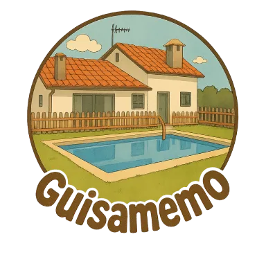

# Guisamemo

**Guisamemo** is a joyful, mobile-first memory game (Memorama-style), designed for children and playable solo or with up to 4 players. Each correct pair earns points—and some special cards double your score!



---

## 🧩 About the Game

Guisamemo is a turn-based progressive web app (PWA) that blends classic memory gameplay with modern accessibility, animations, and custom illustrations.  
The project name is a tribute to **Guísamo**, a village in Galicia, Spain—and to three very special people: **Roque, Telmo and Román**.

---

## ✨ Features

- 🎨 Custom card art with special scoring logic  
- 🌍 Full localization: Spanish and Galician (with `/es` and `/gl` routes)  
- 📱 Responsive layout for mobile, tablets, and desktops  
- 🧑‍🤝‍🧑 Multiplayer mode (1–4 players) with turn skipping on mismatch  
- 🏆 Animated game-over screen: podium or victory message  
- 🕹️ PWA support (installable, offline fallback, manifest, service worker)  
- ♿ Accessibility and semantic HTML support (screen reader friendly)  
- 🔧 Admin-friendly structure prepared for content expansion  

---

## 📌 Latest Version – v1.1.0

- 🌐 Added full internationalization system (i18n) with Context API  
- 🇪🇸🇬🇷 Language toggle on StartScreen with flag icons  
- 🔁 Dynamic update of `<html lang="">` for SEO and accessibility  
- 🏷️ All text content moved to translation files (`es.json`, `gl.json`)  
- 🦮 Improved `aria-label` and tooltips across components  
- 🗺️ Updated sitemap.xml with hreflang and alternate links for SEO  
- ⚙️ Internal rewrites for multilingual SPA routing on Vercel

---

## 📌 MVP Highlights (v1.0.0)

- Responsive layout with 6 board sizes (XS–3XL)  
- Game loop with match detection, score, and skip on fail  
- Podium or solo end screen with animations and fireworks  
- Avatar selector per player  
- Game engine (`useGameEngine`) and shared context state  
- Offline support with custom fallback  
- Initial SEO with structured data and social sharing metadata  

---

## 🗺️ Roadmap (Post-MVP)

- 🔊 Sound effects and feedback animations  
- 🌑 Dark mode theme toggle  
- 🧠 Memory challenge timer or difficulty levels  
- 📈 Ranking and score history  
- 🤝 Social invites and card sharing  
- 🧩 More card styles and visual themes  
- 🧪 Accessibility and SEO refinements

---

## 🔧 Installation (Development)

```bash
git clone https://github.com/fcegatti/guisamemo.git
cd guisamemo
npm install
npm run dev
```

To test the PWA:

```bash
npm run build
npm run preview
```

---

## 🧑‍⚖️ License

This project is licensed under the MIT License.

> You are free to use, modify and distribute this project with attribution.  
> If you plan to use it commercially or as a base for a similar product, please consider the project’s original intention and respect the creator’s plans for a commercial edition.

---

## 👤 Credits

No external assets currently require attribution.  
Credits will be included when external media are added in future releases.

---

## ❤️ Final Words

Guisamemo is a tribute to the joy of childhood and the people we love.  
**Created for Roque, Telmo and Román.**
