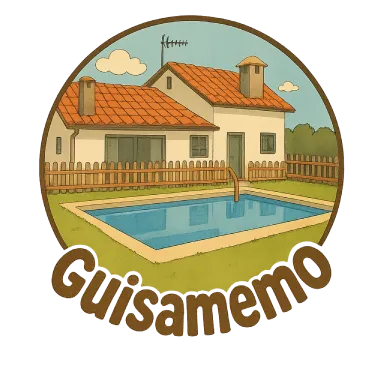

# Guisamemo

**Guisamemo** is a joyful, mobile-first memory game (Memorama-style), designed for children and playable solo or with up to 4 players. Each correct pair earns points—and some special cards double your score!



---

## 🧩 About the Game

Guisamemo is a turn-based progressive web app (PWA) that blends classic memory gameplay with modern accessibility, animations, and custom illustrations.  
The project name is a tribute to **Guísamo**, a village in Galicia, Spain—and to three very special people: **Roque, Telmo and Román**.

---

## ✨ Features

- 🎨 Custom card art with special scoring logic  
- 🌍 Full localization: Spanish and Galician (with `/es` and `/gl` routes)  
- 📱 Responsive layout for mobile, tablets, and desktops  
- 🧑‍🤝‍🧑 Multiplayer mode (1–4 players) with turn skipping on mismatch  
- 🏆 Animated game-over screen: podium or victory message  
- 🕹️ PWA support (installable, offline fallback, manifest, service worker)  
- ♿ Accessibility and semantic HTML support (screen reader friendly)  
- 🔧 Admin-friendly structure prepared for content expansion  

---

## 📌 Latest Version – v1.2.1

- 🧪 **Testing Infrastructure**: Added Vitest and React Testing Library with comprehensive test utilities
- 🏗️ **Code Architecture**: Complete reorganization of React components and CSS structure
- ⌨️ **Enhanced Accessibility**: Roving tabindex keyboard navigation for AAA compliance
- 🦊 **Firefox Compatibility**: Added browser warning and layout fixes
- 🎯 **Developer Experience**: Improved maintainability with logical component grouping
- 📱 **Mobile Optimization**: Enhanced touch targets and progressive loading
- 🔧 **Code Quality**: Defensive validations and refactored game logic handlers
- 🎨 **CSS Modernization**: Kebab-case naming and component-mirrored structure

---

## 📌 MVP Highlights (v1.0.0)

- Responsive layout with 6 board sizes (XS–3XL)  
- Game loop with match detection, score, and skip on fail  
- Podium or solo end screen with animations and fireworks  
- Avatar selector per player  
- Game engine (`useGameEngine`) and shared context state  
- Offline support with custom fallback  
- Initial SEO with structured data and social sharing metadata  

---

## 🗺️ Roadmap (v1.2+)

- 🧠 Memory challenge timer or difficulty levels  
- 🧪 Extended test coverage for game logic and UI components
- 📈 Ranking and score history  
- 🤝 Social invites and card sharing  
- 🧩 More card styles and visual themes 
- 🔍 Advanced accessibility features (enhanced screen reader support - full AAA)

---

## 🔧 Installation (Development)

```bash
git clone https://github.com/fcegatti/guisamemo.git
cd guisamemo
npm install
npm run dev
```

To test the PWA:

```bash
npm run build
npm run preview
```

---

## 🧪 Testing

```bash
# Run test suite
npm run test

# Run tests in watch mode
npm run test -- --watch

# Run tests with coverage
npm run test -- --coverage
```

---

## 🧑‍⚖️ License

This project is licensed under the MIT License.

> You are free to use, modify and distribute this project with attribution.  
> If you plan to use it commercially or as a base for a similar product, please consider the project’s original intention and respect the creator’s plans for a commercial edition.

---

## 👤 Credits

### 🎧 Audio Credits

This project uses the following sound resources under their respective licenses:

---

#### ✅ Correct Match Sound

- 🎵 Sound: "Complete Chime" by [FoolBoyMedia](https://freesound.org/people/FoolBoyMedia/)
- 🔗 https://freesound.org/people/FoolBoyMedia/sounds/352661/  
- 📜 License: [CC BY 4.0](https://creativecommons.org/licenses/by/4.0/)


#### ❌ Incorrect Match Sound

- 🎵 Sound: "ui-mistake.wav" by [StavSounds](https://freesound.org/people/StavSounds/)  
- 🔗 https://freesound.org/people/StavSounds/sounds/701703/  
- 📜 License: [CC0 1.0 (Public Domain)](https://creativecommons.org/publicdomain/zero/1.0/)

#### 🏁 End Game Transition Sound

- 🎵 Sound: "Tada Fanfare A" [plasterbrain](https://freesound.org/people/plasterbrain/)  
- 🔗 https://freesound.org/people/plasterbrain/sounds/397355/  
- 📜 License: [CC0 1.0 (Public Domain)](https://creativecommons.org/publicdomain/zero/1.0/)

#### 🔄 Card Flip Sound

- 🎵 Sound: "Deal.ogg" (edited) by [egomassive](https://freesound.org/people/egomassive/) 
  based on "Card Flip" by [f4ngy](https://freesound.org/people/f4ngy/) 
- 🔗 https://freesound.org/people/egomassive/sounds/536784/  
- 🔗 https://freesound.org/people/f4ngy/sounds/240776/  
- 📜 License: [CC BY 4.0](https://creativecommons.org/licenses/by/4.0/)

---

## ❤️ Final Words

Guisamemo is a tribute to the joy of childhood and the people we love.  
**Created for Roque, Telmo and Román.**
